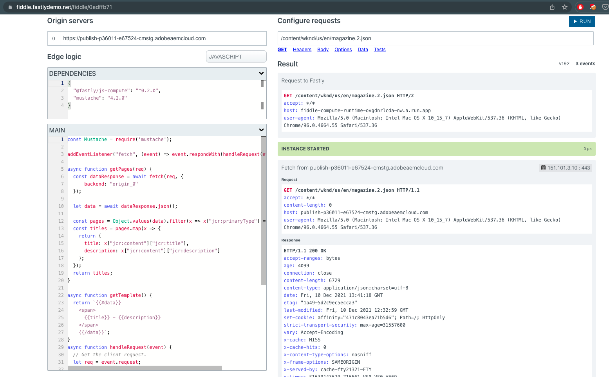
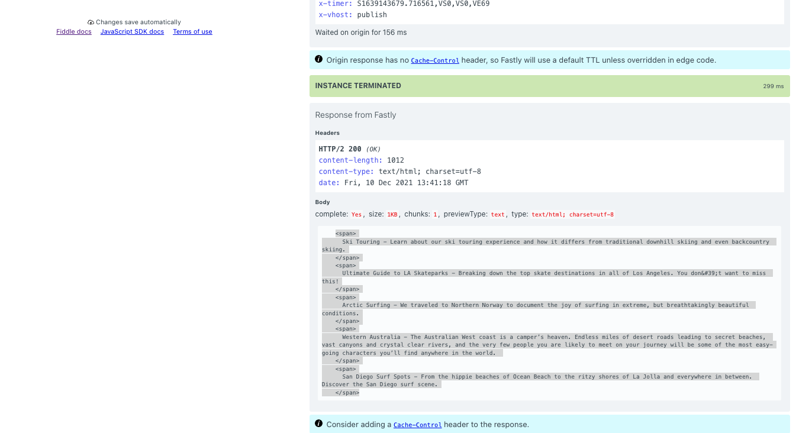

Ref: https://fiddle.fastlydemo.net/fiddle/0edffb71

Language: `Javascript`

Dependencies
```
{
  "@fastly/js-compute": "^0.2.0",
  "mustache": "4.2.0"
}
```

Main
```
const Mustache = require('mustache');

addEventListener("fetch", (event) => event.respondWith(handleRequest(event)));

async function getPages(req) {
  const dataResponse = await fetch(req, {
      backend: "origin_0"
  });
  
  let data = await dataResponse.json();

  const pages = Object.values(data).filter(x => x["jcr:primaryType"] == "cq:Page");
  const titles = pages.map(x => {
    return {
      title: x["jcr:content"]["jcr:title"],
      description: x["jcr:content"]["jcr:description"]
    };
  });
  return titles;
}

async function getTemplate() {
  return `{{#data}}
    <span>
      {{title}} - {{description}}
    </span>
    {{/data}}`;
}
async function handleRequest(event) {
  // Get the client request.
  let req = event.request;


  let pages = await getPages(req);
  let template = await getTemplate(req);

  let respData = JSON.stringify(pages);

  var view = {
    data: pages
  };

  var output = Mustache.render(template, view);

  return new Response(output, {
    status: 200,
    headers: new Headers({ "Content-Type": "text/html; charset=utf-8" }),
  });
}
```

Sample Run:
Origin Servers: 
[0] https://publish-p36011-e67524-cmstg.adobeaemcloud.com

Configure requests:
`/content/wknd/us/en/magazine.2.json`

output
```
<span>
      Ski Touring - Learn about our ski touring experience and how it differs from traditional downhill skiing and even backcountry skiing.
    </span>
    <span>
      Ultimate Guide to LA Skateparks - Breaking down the top skate destinations in all of Los Angeles. You don&#39;t want to miss this!
    </span>
    <span>
      Arctic Surfing - We traveled to Northern Norway to document the joy of surfing in extreme, but breathtakingly beautiful conditions.
    </span>
    <span>
      Western Australia - The Australian West coast is a camper’s heaven. Endless miles of desert roads leading to secret beaches, vast canyons and crystal clear rivers, and the very few people you are likely to meet on your journey will be some of the most easy-going characters you’ll find anywhere in the world. 
    </span>
    <span>
      San Diego Surf Spots - From the hippie beaches of Ocean Beach to the ritzy shores of La Jolla and everywhere in between. Discover the San Diego surf scene.
    </span>
```




